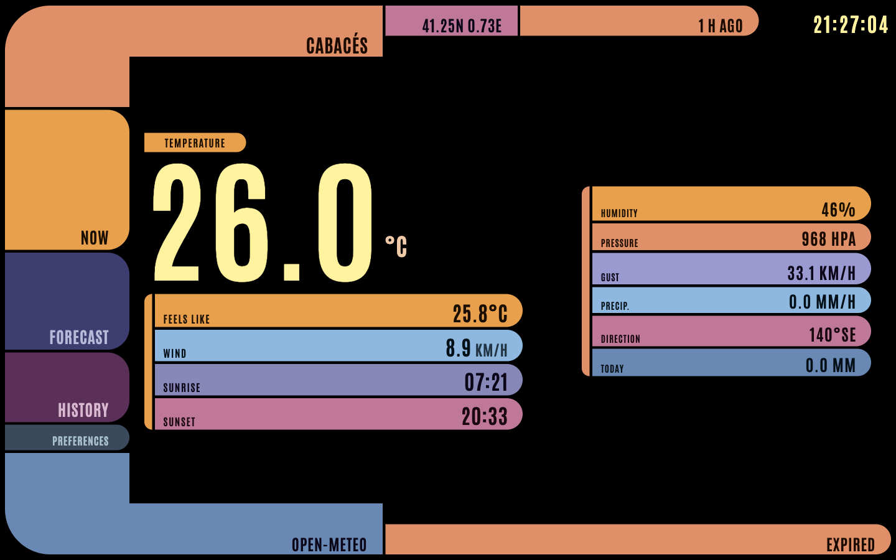

# LCARS Weather Console

[](https://daliife.github.io/star-trek-weather-station/)

Weather from a backyard station in **Cabacés** (Priorat), drawn like a starship ops desk. Open the [live console](https://daliife.github.io/star-trek-weather-station/) and you get current conditions, a short forecast, and recent history on a full-screen TNG-style [LCARS](https://en.wikipedia.org/wiki/LCARS) panel — not a themed widget.

The numbers come from PWS [ICABAC4](https://www.wunderground.com/weather/es/cabac%C3%A9s/ICABAC4) on Weather Underground. English, Catalan, and Spanish labels; metric or imperial units; optional panel beeps (off until you turn them on). Fan project. Not affiliated with Paramount, Star Trek, or Weather Underground.

## What you see

- **Now** — temperature as the main readout, feels-like and wind beside it, then humidity, pressure, gust, rain, direction, and sunrise/sunset from the same snapshot
- **Forecast** — next day/night periods and five days, with rain when the source sends it
- **History** — yesterday, 7 days, 30 days, plus a short last-days strip
- **Preferences** — language, units, and sound (saved in `localStorage`)

Desktop-first. Empty telemetry reads `No data` rather than inventing values. If the observation is older than about 30 minutes, the frame tints stale; the footer still names the real source.

## Local preview

```sh
pnpm install
pnpm fetch-weather
pnpm test
pnpm dev
```

Open [http://localhost:4321/star-trek-weather-station/](http://localhost:4321/star-trek-weather-station/).

Optional: `cp .env.example .env` and set `WU_API_KEY` if you have a contributor key that can read ICABAC4. Without a key, `pnpm fetch-weather` writes a live Open-Meteo snapshot instead.

Requires Node 22+ and pnpm.

## Data flow

GitHub Pages cannot keep a secret, so the key never goes to the browser:

1. `WU_API_KEY` lives as a **GitHub Actions secret** (and a gitignored local `.env`).
2. `scripts/fetch-weather.mjs` writes a sanitized snapshot to `public/data/current.json`.
3. Astro builds and deploys `dist/`. Visitors only load that JSON.

Weather Underground is the primary source for **Now**, **Forecast**, and **History**. Current comes from the [PWS observations](https://developer.weather.com/docs/openapi/pws-observations-current-conditions-2-0/get-v2-pws-observations-current-by-stationid) endpoint; history from PWS daily summaries; forecast from the Weather Company 5-day daily product at the station coordinates. PWS contributor keys are not entitled to `/v3/wx/forecast/hourly/2day` (it returns 401), so the left Forecast column uses the same 5-day **day/night parts** instead of clock hours. The station is fixed in `src/config/station.json`.

If the key is missing or WU cannot serve current conditions, the **whole** snapshot (including series) falls back to [Open-Meteo](https://open-meteo.com/). A WU snapshot never mixes in Open-Meteo forecast or history. If WU current works but series fail, Now stays WU and Forecast/History stay empty. The footer source badge is that snapshot. We do not scrape wunderground.com.

The PWS payload has no sky-condition phrase, so the center readout is temperature. Alert state is a frame tint (`NOMINAL` / `PRECIP` from `precipRate` / `DATA EXPIRED` / `OFFLINE`). Footer link state is `ONLINE` / `STALE` / `NO DATA`.

## Snapshot shape

```json
{
  "source": "wunderground-pws",
  "stationId": "ICABAC4",
  "location": { "name": "Cabacés", "region": "Tarragona", "country": "ES" },
  "fetchedAt": "2026-08-30T15:00:00Z",
  "observedAt": "2026-08-30T15:00:00Z",
  "status": "ok",
  "precipRate": 0,
  "metric": {
    "temp": 30.6,
    "feelsLike": 30.0,
    "humidity": 41,
    "windSpeed": 4.8,
    "windGust": 6.4,
    "windDir": 0,
    "pressure": 1013.2,
    "precipTotal": 0
  }
}
```

`source` is `wunderground-pws` or `open-meteo`. Feels-like is heat index or wind chill from the PWS payload. When the same source can provide it, `series` holds hourly/daily forecast, history ranges, last-days temps, and sun times.

## Language, units, and sound

Labels live in `src/i18n/{en,ca,es}.json` (numbers stay numeric). Default language follows the browser (`ca` / `es` / `en`) until you pick one; default units are metric (°C, km/h, hPa, mm). Imperial is °F, mph, inHg, and inches. Panel beeps default off and stay silent when `prefers-reduced-motion` is set. All three persist in `localStorage`.

Tokens and frame live in `src/styles/lcars.css` (Antonio, own elbows/pills — no LCARS CSS kit). The interactive island is `WeatherConsole.astro`.

## GitHub Pages

1. Add repo secret `WU_API_KEY`.
2. Set Pages source to **GitHub Actions**.
3. `.github/workflows/deploy.yml` runs on push to `main` and `workflow_dispatch` (test → fetch snapshot → build → deploy `dist/`), and on a 15-minute cron that skips tests. GitHub often delays scheduled workflows past 15 minutes (gaps over 30 minutes happen). Live JSON is not committed back to git.

`astro.config.mjs` sets `base` to `/star-trek-weather-station/` for project Pages. Change that if you later use a custom domain or a user site.

## API quota

PWS contributor keys are typically capped at **1500 calls/day** and **30/minute**. Usage is on the WU account under [API Keys](https://www.wunderground.com/member/api-keys) → Show Usage.

The public site does not spend that quota. The browser never sees `WU_API_KEY`. Each visitor only loads `current.json` from Pages. Only `scripts/fetch-weather.mjs` in GitHub Actions (or a local `.env`) calls Weather Underground: **current every run**, plus forecast about every 3 hours and history once per Europe/Madrid day (reused from the live snapshot when still fresh).

The deploy cron is every 15 minutes: about **96 current calls/day** plus ~8 forecast and 1 history if GitHub honors the schedule (in practice often fewer), plus a burst on each push to `main` or a manual run. That stays under 1500. The console polls `current.json` every 10 minutes while the tab is visible. If WU returns 429 or an empty observation, the script falls back to Open-Meteo for the whole snapshot so the console stays up.
